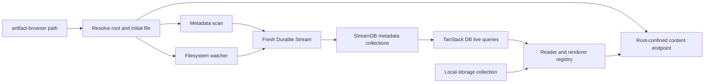
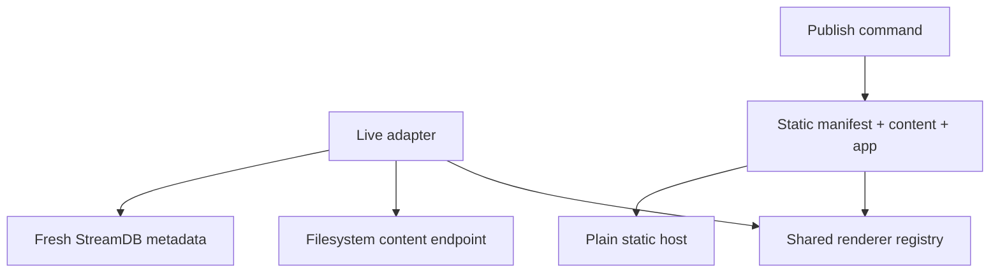

# Artifact Browser and Publishing Protocol — Design

**Date:** 2026-07-28  
**Status:** Approved  
**Projects:** Field Lab, Dialectic Press, and `artifact-browser`

## Summary

Build a local, read-only browser for the files and artifacts produced during
Field Lab and Dialectic Press work.

The filesystem remains the source of truth. A file watcher projects file and
artifact metadata into a fresh Durable Stream for each CLI run. StreamDB exposes
that metadata as TanStack DB collections. The browser fetches file contents on
demand through a root-confined endpoint; file bodies never enter StreamDB.

The same reader and renderer registry also powers a published mode. Publishing
copies selected data, linked assets, schemas, and the required application code
into a static package that can run without a filesystem server, watcher, or
Durable Stream.

This first design supplies:

- a shared artifact protocol and taxonomy;
- a CLI that opens any file or directory in the local browser;
- a strong Markdown reader and renderers for common file types;
- generic views for a small set of semantic artifact shapes;
- live filesystem updates through Durable Streams and StreamDB;
- a static publisher;
- a base for later Field Lab and Dialectic Press migrations.

## Context

Field Lab now contains a growing bench of instruments. Dialectic Press turns
dialectic outputs into candidate cards, validation ledgers, editorial designs,
drafts, and publications. These files are useful to people but hard for an
orchestrating agent to navigate as an undifferentiated list.

A taxonomy helps with two related problems:

1. finding the right instrument or readout;
2. seeing gaps in instrument coverage.

Visualization is part of the same problem. Many readouts have repeatable
semantic shapes—graphs, matrices, ledgers, sequences, and record sets. If those
shapes have formal schemas, a standard application can render them without each
skill building a bespoke viewer. Editorial work remains distinct: an essay or
publication is a crafted representation, not a mechanical chart.

Existing work is mostly Markdown and must remain useful without migration.
Adopting the artifact protocol adds richer views; it is not a requirement for
browsing.

## Goals

- Browse any explicit file inside a chosen filesystem root.
- Open the browser from a working terminal session with one CLI command.
- Render existing Markdown well without changing it.
- Reflect filesystem changes in the browser without a page reload.
- Keep the browser strictly read-only.
- Use TanStack DB for all client state.
- Use Durable Streams and StreamDB only for live metadata transport.
- Give artifacts stable, portable schemas that generic renderers can consume.
- Separate epistemic function, representation, editorial role, and exposure.
- Make instrument coverage and schema gaps visible.
- Produce self-contained static packages for sharing and deployment.
- Preserve a single renderer implementation across live and published modes.

## Non-goals

- Do not move authoritative file contents into a database or stream.
- Do not retain filesystem history across CLI runs.
- Do not edit, rename, or delete files from the browser.
- Do not require existing Markdown to adopt frontmatter or sidecars.
- Do not define one universal payload schema.
- Do not encode screen coordinates in artifact data.
- Do not migrate Field Lab or Dialectic Press in this change.
- Do not replace the editorial judgment in Dialectic Press with a generic
  renderer.
- Do not add collaboration, remote synchronization, or multi-user presence.

## Design Decisions

### Filesystem authority

The filesystem is authoritative for file identity, hierarchy, metadata, and
content. StreamDB is a disposable, live materialized index.

### Fresh stream per run

Each CLI process creates a new stream with a random run identifier. Browser
reloads can replay that run's metadata, but a later CLI run starts from a fresh
scan. Historical file changes have no product value and should not survive.

### Metadata-only StreamDB

StreamDB contains file records, artifact descriptors, workspace state, and
diagnostics. It never contains Markdown, source text, media bytes, or structured
artifact payloads.

### On-demand content

The selected file is fetched from a read-only, root-confined HTTP endpoint.
Client content caching is keyed by file path and current revision.

### One renderer registry

Live and published modes share the same renderer contracts and UI components.
Only their data adapters differ.

### Portable schemas

Artifact files use stable schema identifiers and JSON Schema definitions.
Runtime code implements matching Standard Schema validators. JSON Schema makes
the artifact portable; Standard Schema integrates it with StreamDB and the
application.

## System Architecture



The KPB starter supplies TanStack Start, React, Radix UI, Capsize typography,
TanStack DB, and Durable Streams. The application remains a single project under
`artifact-browser/`.

## CLI and Process Lifecycle

### Commands

```bash
artifact-browser [path]
artifact-browser publish <entry...> --out <directory>
```

`path` may be a file or directory:

- A directory becomes the browser root.
- A file selects its parent directory as the root and opens the file first.
- No path means the current working directory.

The live command:

1. resolves and canonicalizes the target;
2. starts a loopback-only application server;
3. starts a transient local Durable Streams server;
4. creates a fresh stream;
5. starts the watcher and buffers events;
6. scans the root and writes the initial metadata snapshot;
7. applies buffered changes and marks the workspace ready;
8. opens the default browser at the selected file;
9. closes the stream, watcher, and servers when the CLI exits.

Starting the watcher before the scan prevents a change during scanning from
being lost. Events are coalesced by relative path before they are appended.
Initial records and bursts are batched.

Routine generated directories and VCS internals are ignored by default. An
explicit file target bypasses normal navigation ignores. A later CLI option may
expose all ignored files without changing the protocol.

## StreamDB Metadata Model

The state schema has four collections.

### `workspace`

A singleton record describing the current run:

```ts
{
  id: string
  displayName: string
  runId: string
  status: "scanning" | "ready" | "error"
  startedAt: number
  fileCount: number
  artifactCount: number
}
```

The canonical absolute root stays on the server. The client receives a display
name and relative paths, not an authority to read elsewhere.

### `files`

One record per visible file or directory:

```ts
{
  id: string
  path: string
  parentPath: string | null
  name: string
  kind: "file" | "directory" | "symlink"
  extension: string | null
  mimeType: string | null
  size: number | null
  modifiedAt: number | null
  revision: string
  rendererId: string
  readable: boolean
}
```

`id` and `path` are normalized, root-relative paths. `revision` changes whenever
the server observes a meaningful file change. It may combine stat information
with a run-local counter; it is not a content body or durable history token.

### `artifacts`

One descriptor per recognized artifact:

```ts
{
  id: string
  fileId: string
  protocolVersion: string
  schemaId: string
  schemaVersion: string
  title: string
  instrumentId: string | null
  instrumentFamily: InstrumentFamily | null
  contact: Contact | null
  role: ArtifactRole
  representation: Representation
  renderingMode: RenderingMode
  exposure: Exposure
  valid: boolean
}
```

This record contains the fields needed for browsing, filtering, coverage
analysis, and renderer selection. The artifact payload remains in its file.

### `diagnostics`

Recoverable scan, schema, renderer, link, and watcher problems:

```ts
{
  id: string
  fileId: string | null
  severity: "info" | "warning" | "error"
  source: "scan" | "schema" | "watch" | "render" | "publish"
  message: string
  location: string | null
}
```

Diagnostics do not prevent ordinary file browsing.

## TanStack DB Client Model

All state uses TanStack DB, including local UI state. React `useState` is not an
application state store.

### Stream-backed collections

`workspace`, `files`, `artifacts`, and `diagnostics` come directly from
StreamDB. Components query them with `useLiveQuery`; filtering and aggregation
stay in TanStack DB operators so updates remain incremental.

### On-demand content collection

A query-backed collection fetches file contents from the server. Its key is:

```text
<relative-path>@<revision>
```

Changing a file record's revision invalidates the open content record and causes
the reader to fetch the new bytes. Large and binary files are streamed or served
directly rather than copied into a JSON state record.

### Reader preference collection

A local-storage-backed collection persists:

- font pairing;
- color appearance;
- reader width;
- source/rendered preference by file type;
- optional code and diagram settings.

The font pairing switcher includes at least:

- Newsreader + Figtree;
- Source Serif 4 + Source Sans 3;
- Instrument Serif + Instrument Sans;
- Inter;
- Alegreya + Alegreya Sans;
- Playfair Display + Lato;
- Fraunces + Figtree.

### Local UI collection

A local-only collection holds:

- selected file;
- expanded directories;
- active browser filter;
- search text;
- inspector visibility;
- active renderer view;
- transient notices.

## Content API and Root Confinement

The server exposes read-only operations for:

- file bytes;
- text with encoding information;
- download responses;
- safe metadata needed by native renderers.

Every request:

1. accepts a normalized relative path;
2. resolves it against the canonical root;
3. checks the resolved real path is still inside that root;
4. rejects traversal, absolute paths, null bytes, and escaping symlinks;
5. opens the file without granting a write handle.

The server binds only to loopback. It emits restrictive content security policy
headers. Arbitrary HTML never runs in the main application origin.

## Artifact Protocol

### Progressive adoption

The browser recognizes artifacts in this order:

1. explicit artifact envelope;
2. artifact sidecar;
3. Markdown frontmatter;
4. inferred document metadata;
5. generic file metadata.

Every file therefore remains browsable. Protocol adoption only adds semantic
views, validation, filtering, and publishing rules.

### Markdown

Markdown may add an `artifact` object to YAML frontmatter:

```yaml
---
artifact:
  protocol: "1"
  schema: "field-lab/ledger"
  schemaVersion: "1"
  title: "Candidate validation"
  role: "reading"
  representation: "ledger"
  renderingMode: "instrumented"
  exposure: "checkpoint"
  instrument:
    id: "hostile-assay"
    family: "test"
    contact: "artifact"
---
```

The Markdown body remains the content. Existing frontmatter fields outside
`artifact` remain untouched.

### Structured artifacts

`.artifact.json` and `.artifact.yaml` files use:

```json
{
  "$schema": "urn:field-lab:schema:artifact-envelope:1",
  "artifact": {
    "protocol": "1",
    "schema": "field-lab/graph",
    "schemaVersion": "1",
    "title": "Position dependencies",
    "role": "map",
    "representation": "graph",
    "renderingMode": "mechanical",
    "exposure": "internal"
  },
  "data": {}
}
```

A sidecar named `<filename>.artifact.json` may describe a file format that
cannot carry metadata. Its `data` may contain semantic annotations but not a
second copy of the target file.

Unknown protocol or schema versions open in raw mode with a diagnostic.

## Taxonomy

The taxonomy uses independent facets. No facet is overloaded to stand in for
another.

### Instrument family

What epistemic operation the instrument performs:

| Family | Purpose | Examples |
|---|---|---|
| `elicit` | Draw out aims, stakes, criteria, or commitments | focus interview, elenchus |
| `map` | Make structure, terms, dependencies, or positions legible | substrate map, stake map |
| `reframe` | Change the frame to expose hidden assumptions | third-pole, defamiliarize |
| `explore` | Generate or traverse candidate space | attribute interpolation, blind cartography |
| `test` | Stress a claim, transfer, or candidate | hostile assay, belief stress |
| `audit` | Check controls, sensitivity, residue, or calibration | neutral control, loss audit |
| `retain` | Preserve useful state for later inquiry | atlas |

### Contact

What the instrument directly works on:

```text
person | artifact | model | field | record
```

### Artifact role

What place the artifact holds in the work:

```text
reading | map | candidate | design | draft | publication | handoff
```

### Representation

What semantic shape a renderer receives:

```text
document | record-set | sequence | matrix | graph | series | ledger
```

### Rendering mode

How much representational judgment the view contains:

```text
mechanical | instrumented | editorial
```

- `mechanical` views render a schema without making a new analytical claim.
- `instrumented` views embody a named analytical choice or projection.
- `editorial` views craft an argument or experience for an audience.

### Exposure

Where the artifact may travel:

```text
internal | checkpoint | public
```

These facets support coverage views such as instrument family by contact,
instrument family by representation, and artifact role by exposure. Empty cells
indicate possible coverage or schema gaps; they do not prove a missing
instrument.

## Semantic Payload Schemas

The first protocol defines a small family of reusable payload shapes:

- `document`: ordered prose and media;
- `record-set`: typed cards or entities;
- `sequence`: ordered stages, events, or outline nodes;
- `matrix`: row and column dimensions with cell values;
- `graph`: nodes, edges, and optional groups;
- `series`: observations over an ordered domain such as time or iteration;
- `ledger`: append-oriented entries with claims, support, state, and provenance.

Schemas describe meaning, identity, relationships, and allowed values. They do
not describe pixels, coordinates, colors, or chart library options.

A renderer registry maps:

```text
schema ID + representation + supported version → renderer
```

An unknown schema falls back to generic JSON, YAML, table, or source views.
Known schemas may offer several views without changing the artifact.

## Browser Interaction

The app uses a restrained three-part shell:

- a collapsible filesystem and artifact browser on the left;
- the reader or visualization in the center;
- a collapsible metadata and diagnostics inspector on the right.

The center remains the visual focus. Routes deep-link to a relative path and
view without exposing an absolute filesystem path.

The left browser supports:

- directory hierarchy;
- path, title, and artifact-metadata search;
- recent files;
- file-type filters;
- artifact taxonomy filters;
- an instrument catalog;
- coverage matrices for taxonomy and renderer gaps.

Watcher updates preserve selection, expanded folders, active filters, and reader
layout. An open file refetches when its revision changes. The reader preserves
scroll when the changed document still has a stable nearby anchor.

## Markdown Reader

Markdown is the primary prose format and receives the highest design attention.
The reader supports:

- GitHub-Flavored Markdown;
- tables, task lists, footnotes, and heading anchors;
- syntax-highlighted code with copy controls;
- Mermaid diagrams;
- local relative images and media;
- local relative links that navigate inside the browser;
- rendered and source views;
- sanitized inline HTML;
- readable measure and responsive type;
- explicit Capsize-aware spacing through parent gaps;
- selectable font pairings persisted in local storage.

Mermaid runs with strict security settings. Links that escape the chosen root do
not become content reads.

## Other Renderers

| Input | Default view |
|---|---|
| JSON or YAML | Known artifact renderer, otherwise structured tree |
| Source code or plain text | Highlighted source or plain preformatted text |
| Image | Scaled image with dimensions and metadata |
| Audio or video | Native media controls |
| PDF | Embedded PDF reader |
| HTML | Sandboxed preview with source toggle |
| CSV or TSV | Virtualized table |
| Unknown binary | Metadata, download, and system-open actions |

Each renderer sits behind an error boundary. A renderer failure leaves the file
browser and raw-file actions usable.

## Published Mode

Published mode turns selected artifacts, data, assets, schemas, and application
code into a static deployable package.



### Output

A published directory contains:

```text
dist/
├── index.html
├── assets/              # compiled application and renderer code
├── data/
│   ├── manifest.json    # files, artifacts, routes, schemas, diagnostics
│   ├── schemas/
│   └── content/         # hashed file contents and linked assets
└── publish-report.json
```

Static routes use fragments or query parameters so the package works on a plain
HTTP file server without rewrite rules. All generated URLs are relative so the
directory can be hosted at a domain root or nested path.

The static adapter loads the manifest into read-only TanStack DB collections.
The reader and renderer components are the same as live mode. Published mode
contains no watcher, content API, filesystem authority, or Durable Streams
client connection. The publisher resolves the selected artifacts' renderer IDs
and includes their code chunks plus the core fallback renderers.

### Selection

Publishing fails closed:

- Explicit file arguments become entry points.
- Their linked local media and declared artifact dependencies are included.
- A directory argument includes artifacts marked `public`.
- Plain files without exposure metadata are omitted from a directory-wide
  publish unless named explicitly.
- `internal` and `checkpoint` artifacts require an explicit override.
- A dependency outside the chosen root is rejected.

The dependency collector follows Markdown links, media references, structured
artifact references, renderer-declared dependencies, and sidecars. It reports
missing files, escaping paths, unsupported dynamic references, schema errors,
and exposure conflicts before writing the output.

The publisher stages output in a temporary sibling directory and moves it into
place only after validation and rendering checks succeed. Existing output is
not replaced unless the user explicitly requests replacement.

### Dialectic Press

A Press publication artifact may publish as:

- one focused essay and its evidence;
- a collection of related essays;
- an editorial map with candidate and validation views;
- a browsable handoff package.

The static package does not flatten editorial artifacts into mechanical views.
It preserves each artifact's rendering mode and selected editorial renderer.

## Failure and Recovery

- A malformed artifact opens in raw mode and emits schema diagnostics.
- A missing renderer falls back to a generic structured or source view.
- A deleted open file remains selected as a tombstone until the user navigates.
- A transient watcher failure is reported and retried.
- A stream disconnect reconnects and resumes within the current run.
- If stream recovery fails, the server may reset and emit a fresh metadata
  snapshot from the filesystem.
- A content fetch whose revision changed mid-read returns a retryable conflict.
- A publish validation failure leaves no partial output package.
- A single renderer crash cannot take down navigation or other files.

## Project Structure

```text
artifact-browser/
├── src/
│   ├── cli/           # open, serve, and publish commands
│   ├── server/        # confinement, content API, scan, and watch
│   ├── protocol/      # envelopes, schemas, taxonomy, registry contracts
│   ├── collections/   # StreamDB, content, preferences, and UI state
│   ├── renderers/     # Markdown, files, and semantic artifact views
│   ├── publishing/    # dependency collection and static bundle
│   ├── components/    # shell, navigation, reader, and controls
│   └── routes/
└── fixtures/
```

The project does not begin as a monorepo. Protocol and renderer boundaries are
plain internal modules that can become packages only when another application
needs to consume them.

## Verification

### Unit tests

- artifact envelope and taxonomy validation;
- schema-version dispatch;
- relative-path normalization;
- traversal and symlink rejection;
- dependency collection and exposure rules;
- MIME and renderer selection;
- link rewriting;
- preference collection persistence.

### Integration tests

- initial scan produces the expected StreamDB collections;
- add, change, delete, directory, and rename events update live queries;
- watcher changes during the initial scan are not lost;
- reconnect and fresh-snapshot recovery converge on filesystem state;
- an open file refetches on revision change;
- malformed artifacts remain browsable;
- publish failures leave the destination unchanged.

### Browser and visual tests

- Markdown fixtures for every supported feature;
- Mermaid, code, tables, media, and relative links;
- each font pairing at narrow and wide reader measures;
- keyboard navigation and collapsed-panel layouts;
- coverage matrices and artifact filters;
- renderer error boundaries;
- live updates without losing selection;
- accessibility checks for navigation and controls.

### Published-package tests

- serve the output with a plain static HTTP server;
- compare live and static rendering for the same fixture;
- verify every manifest content reference exists;
- verify no undeclared, internal, or escaping file enters the bundle;
- verify direct and nested navigation without server rewrites;
- verify the package makes no request to a live application or stream API.

## Acceptance Criteria

The first implementation is complete when:

1. `artifact-browser <file-or-directory>` opens the correct root and selection.
2. Existing Markdown renders with the approved typography and feature set.
3. The font switcher persists its choice through a TanStack DB local-storage
   collection.
4. Common text, structured, media, PDF, and tabular files render or fall back
   safely.
5. Filesystem changes appear without a page reload.
6. StreamDB contains metadata and diagnostics but no file bodies.
7. All reads remain inside the selected root and the UI performs no writes.
8. Artifact metadata can be filtered by every taxonomy facet.
9. At least one generic view exists for each semantic payload family.
10. Coverage views expose empty taxonomy and renderer cells.
11. `artifact-browser publish` emits a self-contained static package.
12. The published package observes exposure rules and renders without a live
    server.

## Follow-up Specifications

After this foundation is implemented:

1. **Field Lab artifact migration** — annotate instrument cards, readouts, Field
   Logs, Expedition Logs, and atlases; define which instruments emit which
   semantic schemas.
2. **Dialectic Press artifact migration** — annotate candidate cards,
   validation ledgers, editorial designs, drafts, publications, and handoffs;
   define editorial renderers.
3. **Coverage audit** — populate the instrument registry and use the browser's
   matrices to identify missing contacts, tests, controls, and readouts.

## References

- [KPB](https://github.com/KyleAMathews/kpb)
- [TanStack DB overview](https://tanstack.com/db/latest/docs/overview)
- [TanStack DB live queries](https://tanstack.com/db/latest/docs/guides/live-queries)
- [Durable Streams StreamDB](https://durablestreams.com/stream-db)
- [Durable Streams StreamFS](https://durablestreams.com/stream-fs)
- [Durable Streams JSON mode](https://durablestreams.com/json-mode)
- [Capsize Radix UI typography skill](https://github.com/KyleAMathews/vite-plugin-capsize-radix-ui/blob/main/SKILL.md)
- [`reference/instrument-contract.md`](../../../reference/instrument-contract.md)
- [`reference/field-log-template.md`](../../../reference/field-log-template.md)
- [`reference/expedition-log-template.md`](../../../reference/expedition-log-template.md)
- [`reference/dialectic-wiki.md`](../../../reference/dialectic-wiki.md)
- [`dialectic-press/SKILL.md`](../../../../dialectic-press/SKILL.md)
